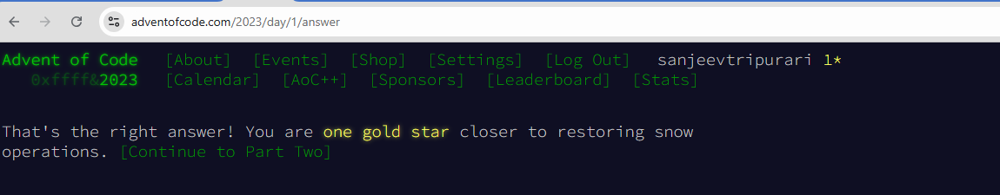
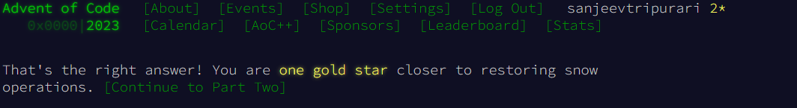
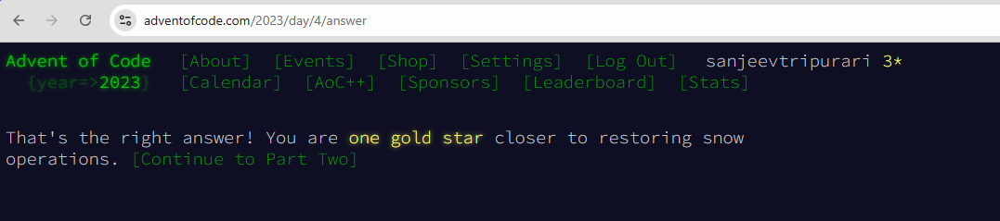

# dataart-homework

## Day 2 - AI BootCamp in India

# Task 1: Work with code: 
* Go to https://adventofcode.com/ site, register, pick any 3 tasks, solve with Chat GPT
* Verify results on the https://adventofcode.com/ site, send link & screenshot to code task status
## Solution
* Code 1
  * [https://adventofcode.com/2023/day/1](https://adventofcode.com/2023/day/1)
   
* Code 2
  * [https://adventofcode.com/2023/day/2](https://adventofcode.com/2023/day/2)
   
* Code 3
  * [https://adventofcode.com/2023/day/4](https://adventofcode.com/2023/day/4)
   
 
# Task 2: Generate text:
* Write down your main 5-7 takeaways from this course, ask Chat GPT to generate one pager instructions for two different roles (2 of BA, QA, PM)
  , from this takeaway points
* Provide ChatGPT sample text paragraph with your own style (informal/formal/etc). 
* Tune prompt and sample "you style paragraph to achieve cleaner, smarter text"
## Solution
* [Question 2](/Question2.md)

# Task 3: Extract data:
* Pick any 30+ page text (without copyright). Pick any 5 facts that you want to extract from the text 
  (characters, locations, plot, used model of cars, etc) (use some book from https://www.gutenberg.org as example)
* Create prompt that returns 2-3 paragraph summary & extracts the facts you have pick. 
* Verify that summary and facts are correct
## Solution
* [Question 3](/Question3.md)
* [Question 3 cont.](Question3.cont.md)
